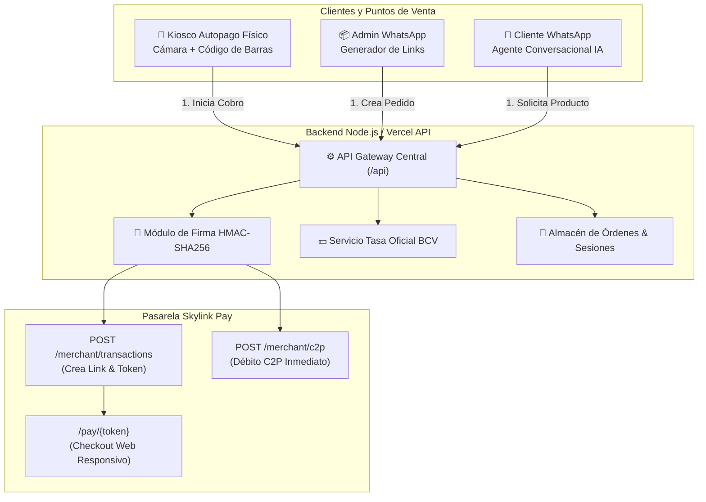

# Arquitectura y Guía de Construcción: Kiosco Autopago y Cobro Automatizado por Link (Skylink Pay)

Este documento contiene la **especificación técnica completa, código fuente de referencia y pasos paso a paso** para reconstruir desde cero ambos modelos de negocio utilizando la pasarela de pagos venezolana **Skylink Pay (Valink Group)**:

1. **Modelo 1 — Kiosco de Autopago Físico / Digital:** Escáner con cámara y lector de código de barras (EAN-13 / QR), catálogo táctil cotizado a Tasa BCV, cobro directo C2P en pantalla / QR móvil, ticket digital y cancelación en todo momento.
2. **Modelo 2 — Cobro con Link Automatizado (Admin + Agente WhatsApp con IA):** Panel de creación de links con tasa BCV, Agente IA conversacional que cotiza en lenguaje natural, genera el enlace de Skylink Pay, verifica la transacción y registra el envío con **código interno de despacho** y notificación de seguimiento.

---

## 1. Parámetros y Credenciales de Skylink Pay

### 1.1. Datos de Conexión (Ambiente Dev / Staging)
* **Dashboard Desarrolladores:** `https://skylinkpay.valinkgroup.com/dashboard/desarrolladores`
* **Base URL API:** `https://dev-axis-payment.valinkgroup.com`
* **Host:** `dev-axis-payment.valinkgroup.com`
* **Código de Comercio (`X-Commerce-Code` / `X-Commerce-Id`):** `754947900700`
* **API Key Secreta (`X-Api-Key`):** `69eee97e8222057c16cc567a0def8c3cc9216eefd3178ce1ce47b847706d82b2`

---

## 2. Reglas Críticas de Integración Skylink Pay

### 2.1. Montos en Céntimos (Unidades Menores)
> [!IMPORTANT]
> El API de Skylink Pay recibe los montos en **céntimos enteros** (últimos 2 dígitos son céntimos).
> * Bs. 10,00 $\rightarrow$ `1000`
> * Bs. 25,50 $\rightarrow$ `2550`
> * **Fórmula:** `Math.round(montoBs * 100)`
> * Si envías `10` sin convertir, el cobro se procesará por **Bs. 0,10**.

### 2.2. Algoritmo de Firma HMAC-SHA256
Toda consulta privada a `/api/v1/merchant/*` requiere 5 cabeceras obligatorias:
1. `X-Api-Key`: Tu API Key secreta.
2. `X-Commerce-Code`: Tu código de comercio (`754947900700`).
3. `X-Commerce-Id`: Tu código de comercio (`754947900700`).
4. `X-Timestamp`: Tiempo actual en milisegundos (`Date.now()`).
5. `X-Signature`: Firma criptográfica calculada en el backend.

**Cadena a firmar:**
$$\text{stringToSign} = \text{timestamp} + "." + \text{METHOD} + "." + \text{path} + "." + \text{body}$$

* `timestamp`: Mismo valor enviado en `X-Timestamp`.
* `METHOD`: En mayúsculas (`POST`, `GET`, etc.).
* `path`: Ruta del endpoint (ej. `/api/v1/merchant/transactions` o `/api/v1/merchant/c2p`).
* `body`: El JSON crudo sin espacios adicionales (en `GET` se deja vacío tras el punto: `timestamp.GET.path.`).

#### Implementación en Node.js (Firma Universal):
```javascript
const crypto = require('crypto');

function generarFirmaHMAC(method, path, bodyString, timestamp, apiKey) {
  const payload = `${timestamp}.${method.toUpperCase()}.${path}.${bodyString || ''}`;
  return crypto.createHmac('sha256', apiKey).update(payload).digest('hex');
}
```

---

## 3. Endpoints Clave de Skylink Pay

### 3.1. Crear Transacción (Para Links de Pago y Checkout Web)
Genera una sesión de pago y devuelve el token y la URL pública para el cliente.
* **Método:** `POST`
* **URL:** `https://dev-axis-payment.valinkgroup.com/api/v1/merchant/transactions`
* **Cabeceras:** HMAC activado (`Content-Type: application/json`)
* **Body:**
```json
{
  "buyOrder": "ORD-1001",
  "sessionId": "SES-1001",
  "amount": 2500,
  "currency": "VES",
  "installments": 1
}
```
* **Respuesta típica:**
```json
{
  "success": true,
  "token": "tok_9f81a7b...",
  "url": "https://dev-axis-payment.valinkgroup.com/pay/tok_9f81a7b..."
}
```

### 3.2. Cobro C2P Directo (Para Kiosco en Pantalla)
Permite procesar el débito directo mediante Pago Móvil C2P pidiendo la clave OTP al cliente en el kiosco.
* **Método:** `POST`
* **URL:** `https://dev-axis-payment.valinkgroup.com/api/v1/merchant/c2p`
* **Cabeceras:** HMAC activado
* **Body:**
```json
{
  "buyOrder": "ORD-C2P-1",
  "sessionId": "SES-1",
  "amount": 1500,
  "currency": "VES",
  "telefono": "04145555555",
  "cedula": "V12345678",
  "banco": "0192",
  "nombre": "Maria Perez",
  "otp": "19807849"
}
```

### 3.3. Solicitar OTP C2P (Vía Checkout Público del Token)
* **Método:** `POST`
* **URL:** `https://dev-axis-payment.valinkgroup.com/pay/{token}/otp`
* **Cabeceras:** `Content-Type: application/x-www-form-urlencoded`, `Accept: application/json` (Sin HMAC)
* **Body Form:** `telefono=04145555555&cedula=V12345678&banco=0192&nombre=Maria+Perez`

### 3.4. Confirmar Pago C2P con OTP (Vía Checkout Público)
* **Método:** `POST`
* **URL:** `https://dev-axis-payment.valinkgroup.com/pay/{token}`
* **Cabeceras:** `Content-Type: application/x-www-form-urlencoded`, `Accept: application/json` (Sin HMAC)
* **Body Form:** `telefono=04145555555&cedula=V12345678&banco=0192&nombre=Maria+Perez&otp=19807849`

### 3.5. Listar y Consultar Transacciones
* **Método:** `GET`
* **URL:** `https://dev-axis-payment.valinkgroup.com/api/v1/merchant/transactions?page=1&limit=20`
* **Cabeceras:** HMAC activado

---

## 4. Arquitectura del Sistema



---

## 5. Modelo 1: Kiosco Autopago (Construcción Paso a Paso)

### 5.1. Componentes Frontend
1. **Lector de Código de Barras por Cámara Web / Celular:**
   * Utiliza la API nativa `BarcodeDetector` del navegador y la librería `ZXing` local (`/zxing.min.js`) como respaldo universal.
   * Abre directamente con `getUserMedia` usando `{ video: { facingMode: { ideal: "environment" } } }` para cámara trasera en móviles y webcam en PC.
   * Reconoce códigos estándar venezolanos como **Arroz Blanco `7591473005492`** y códigos QR.
   * Emite sonido *beep* (vía Web Audio API) y vibración háptica al detectar el producto.
2. **Catálogo Táctil y Carrito en Vivo:**
   * Lista productos con precio en USD y conversión automática a Bolívares usando la tasa BCV del día.
   * El carrito permite agregar, restar, vaciar y ver el total calculado.
3. **Modal de Pago con Opciones Claras:**
   * **Opción A (Celular / QR):** El backend crea la transacción en Skylink Pay (`/merchant/transactions`), obtiene el token y genera un código QR en pantalla con la URL `/pay/{token}` para que el cliente pague desde su teléfono.
   * **Opción B (Aquí mismo en Pantalla - C2P Directo):** Pide Cédula, Teléfono, Banco y OTP C2P y envía el débito inmediato a `/merchant/c2p`.
   * **Opción Cancelar:** Botón visible en todo momento para abortar la compra y regresar al carrito sin trabas.
4. **Ticket de Compra Digital:**
   * Al recibir la confirmación de pago, muestra el comprobante fiscal/control con desglose de productos, referencia bancaria y botón de impresión.

---

## 6. Modelo 2: Cobro por Link Automatizado (Admin + Agente IA)

### 6.1. Panel Administrativo (Admin Web)
* **Selección de Productos:** El vendedor toca los productos deseados del catálogo.
* **Cálculo en Tiempo Real:** Multiplica el subtotal en USD por la tasa BCV oficial y formatea el monto en céntimos para Skylink Pay.
* **Generación de Link:** Llama a `/api/create-order-link`, que firma con HMAC la transacción en Skylink Pay y obtiene la URL pública de pago.
* **Envío a WhatsApp:** Botón que abre `wa.me/?text=...` con el mensaje precargado listo para mandar al cliente.

### 6.2. Agente Inteligente de WhatsApp (Ventas y Despacho)
El agente automatiza el ciclo de ventas completo dentro de WhatsApp o simulador web:

1. **Comprensión en Lenguaje Natural:**
   * El cliente escribe: *"Hola, quiero comprar 2 kilos de arroz"*.
   * La IA analiza el texto, identifica el producto (Arroz Blanco 1kg x 2 = $2.20 USD).
2. **Cotización y Generación del Enlace:**
   * Convierte a Bolívares con la tasa BCV (ej: $2.20 $\times$ 37.50 = Bs. 82,50 $\rightarrow$ `amount: 8250` céntimos).
   * Llama a Skylink Pay (`POST /api/v1/merchant/transactions`) y obtiene la URL de pago.
   * Envía por WhatsApp el mensaje con el link oficial de pago.
3. **Verificación Bancaria:**
   * Monitorea la transacción hasta confirmar el estado exitoso.
   * Envía confirmación:
     > *"🎉 ¡Tu pago ha sido verificado con éxito! Ref: #[REF]. Por favor, indícanos tus datos para coordinar el despacho..."*
4. **Guía Interna de Despacho (Requisito Clave):**
   * El cliente envía sus datos (Nombre, Cédula, Teléfono, Destino).
   * El sistema **asigna un código interno de control** (ej: `INT-517035`), sin vincular guías de terceros.
   * Responde con la frase exacta requerida:
     > *"✅ ¡Datos de envío registrados con éxito! 📦*  
     > *📌 Código interno de despacho: **INT-517035***  
     >  
     > ***Cuando tengamos tu guía de envío te la haremos llegar por aquí.*** *¡Muchas gracias por tu compra! 🙌"*

---

## 7. Implementación Completa del Backend (Node.js)

A continuación se presenta el código backend unificado listo para producción (`server.js` o `/api/index.js`), que implementa la firma HMAC de Skylink Pay, la conversión en céntimos y los endpoints requeridos por el kiosco y el agente.

```javascript
const https = require('https');
const crypto = require('crypto');

// Credenciales Skylink Pay
const SKYLINK_CONFIG = {
  baseUrl: process.env.SKYLINK_BASE_URL || 'https://dev-axis-payment.valinkgroup.com',
  apiKey: process.env.SKYLINK_API_KEY || '69eee97e8222057c16cc567a0def8c3cc9216eefd3178ce1ce47b847706d82b2',
  commerceCode: process.env.SKYLINK_COMMERCE_CODE || '754947900700'
};

// Tasa referencial BCV
let bcvRate = 37.50;

// Memoria de órdenes
const orders = new Map();

/**
 * Función Universal para Llamadas Firmadas a Skylink Pay
 */
function fetchSkylinkPay(endpoint, method = 'POST', bodyObj = null) {
  return new Promise((resolve, reject) => {
    const url = new URL(endpoint, SKYLINK_CONFIG.baseUrl);
    const timestamp = Date.now().toString();
    const bodyString = bodyObj ? JSON.stringify(bodyObj) : '';

    // Cálculo de la firma HMAC-SHA256: timestamp.METHOD.path.body
    const stringToSign = `${timestamp}.${method.toUpperCase()}.${url.pathname}.${bodyString}`;
    const signature = crypto
      .createHmac('sha256', SKYLINK_CONFIG.apiKey)
      .update(stringToSign)
      .digest('hex');

    const headers = {
      'Content-Type': 'application/json',
      'X-Api-Key': SKYLINK_CONFIG.apiKey,
      'X-Commerce-Code': SKYLINK_CONFIG.commerceCode,
      'X-Commerce-Id': SKYLINK_CONFIG.commerceCode,
      'X-Timestamp': timestamp,
      'X-Signature': signature
    };

    const req = https.request(url, { method, headers }, (res) => {
      let data = '';
      res.on('data', chunk => data += chunk);
      res.on('end', () => {
        try {
          resolve({ status: res.statusCode, data: JSON.parse(data) });
        } catch (e) {
          resolve({ status: res.statusCode, raw: data });
        }
      });
    });

    req.on('error', reject);
    if (bodyString) req.write(bodyString);
    req.end();
  });
}

/**
 * 1. Endpoint: Crear Transacción (Para Links de Pago y Checkout)
 */
async function crearTransaccionSkylink(buyOrder, sessionId, amountUsd) {
  // Convertir USD a Bolívares y luego a céntimos enteros (x 100)
  const amountBs = Number((amountUsd * bcvRate).toFixed(2));
  const amountCentimos = Math.round(amountBs * 100);

  const payload = {
    buyOrder: buyOrder,
    sessionId: sessionId,
    amount: amountCentimos,
    currency: 'VES',
    installments: 1
  };

  const res = await fetchSkylinkPay('/api/v1/merchant/transactions', 'POST', payload);
  return {
    amountBs,
    amountCentimos,
    skylinkResponse: res.data
  };
}

/**
 * 2. Endpoint: Cobro Directo C2P con OTP (Para Pantalla del Kiosco)
 */
async function cobrarC2PDirecto(buyOrder, sessionId, amountUsd, c2pData) {
  const amountBs = Number((amountUsd * bcvRate).toFixed(2));
  const amountCentimos = Math.round(amountBs * 100);

  const payload = {
    buyOrder: buyOrder,
    sessionId: sessionId,
    amount: amountCentimos,
    currency: 'VES',
    telefono: c2pData.telefono, // Ej: "04145555555"
    cedula: c2pData.cedula,     // Ej: "V12345678"
    banco: c2pData.banco,       // Código de 4 dígitos, ej: "0192"
    nombre: c2pData.nombre,
    otp: c2pData.otp            // Clave OTP C2P
  };

  const res = await fetchSkylinkPay('/api/v1/merchant/c2p', 'POST', payload);
  return res.data;
}

/**
 * 3. Endpoint: Guardar Envío con Código Interno de Despacho
 */
function registrarEnvioInterno(orderId, shippingData) {
  const order = orders.get(orderId);
  if (!order) throw new Error('Orden no encontrada');

  const internalGuide = 'INT-' + Math.floor(100000 + Math.random() * 900000);

  const record = {
    guideNumber: internalGuide,
    isInternalGuide: true,
    noticeMessage: 'Cuando tengamos tu guía de envío te la haremos llegar por aquí',
    recipientName: shippingData.recipientName || order.clientName,
    recipientId: shippingData.recipientId,
    recipientPhone: shippingData.recipientPhone,
    destination: shippingData.destination,
    registeredAt: new Date().toISOString()
  };

  order.shippingData = record;
  return record;
}
```

---

## 8. Pasos para Recrear el Proyecto desde Cero

1. **Inicializar Proyecto:**
   ```bash
   mkdir spidi-skylink && cd spidi-skylink
   npm init -y
   ```
2. **Crear Estructura de Carpetas:**
   ```
   spidi-skylink/
   ├── api/
   │   └── index.js          # API Serverless para Vercel
   ├── public/
   │   ├── index.html        # Kiosco de Autopago
   │   ├── admin.html        # Panel de Creación de Links
   │   ├── chat.html         # Simulador WhatsApp con IA
   │   ├── checkout.html     # Redirección de Pago Skylink
   │   ├── factura.html      # Ticket / Comprobante
   │   └── zxing.min.js      # Librería de código de barras offline
   ├── server.js             # Servidor HTTP Node.js local
   └── vercel.json           # Rutas y rewrites para producción
   ```
3. **Instalación de Dependencias:**
   * El sistema está diseñado **zero-dependency** usando módulos nativos de Node.js (`http`, `https`, `crypto`). No requiere librerías pesadas para correr.
4. **Configurar Variables de Entorno (`.env` o Vercel):**
   ```env
   SKYLINK_BASE_URL=https://dev-axis-payment.valinkgroup.com
   SKYLINK_API_KEY=69eee97e8222057c16cc567a0def8c3cc9216eefd3178ce1ce47b847706d82b2
   SKYLINK_COMMERCE_CODE=754947900700
   PORT=3000
   ```
5. **Ejecutar Localmente:**
   ```bash
   node server.js
   ```
6. **Despliegue a Producción (Vercel):**
   ```bash
   vercel --prod
   ```

---

## 9. Resumen de Flujos de Usuario

| Flujo | Entrada | Proceso Skylink Pay | Salida |
| :--- | :--- | :--- | :--- |
| **Kiosco Móvil (QR)** | Cliente escanea productos | `POST /merchant/transactions` con monto en céntimos | Muestra QR con URL `/pay/{token}` |
| **Kiosco en Pantalla** | Cliente ingresa C2P y OTP | `POST /merchant/c2p` firmado con HMAC | Débito inmediato y ticket impreso |
| **Admin de Links** | Vendedor selecciona productos | `POST /merchant/transactions` cotizado al BCV | Genera link y botón `wa.me` |
| **Agente IA WhatsApp** | Cliente pide por chat | Parser de texto $\rightarrow$ `transactions` | Envía link $\rightarrow$ Confirma pago $\rightarrow$ Asigna guía `INT-XXXXXX` |
